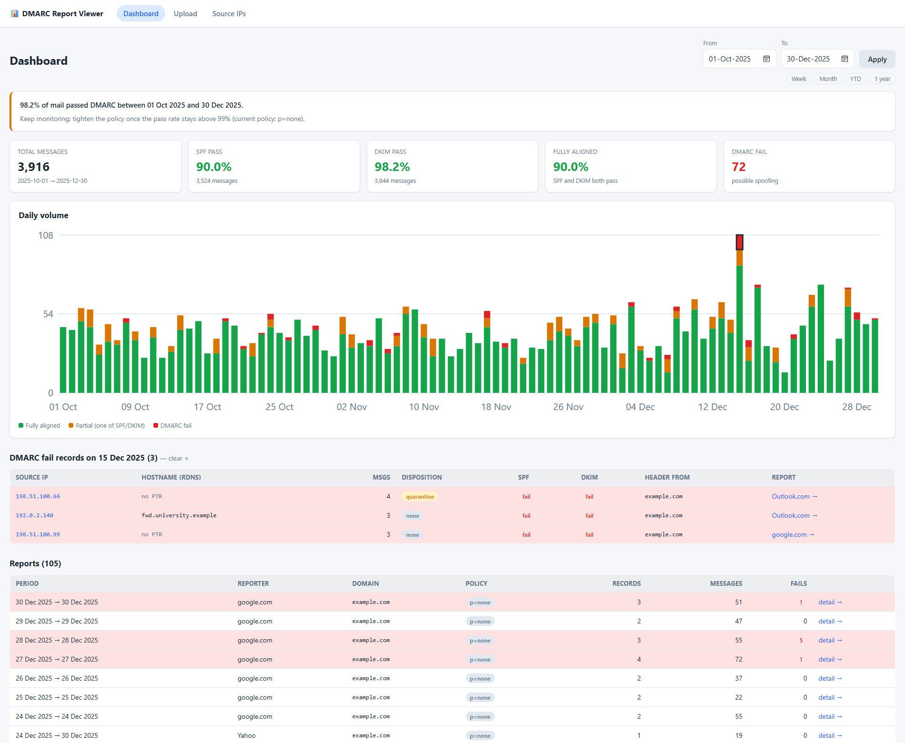
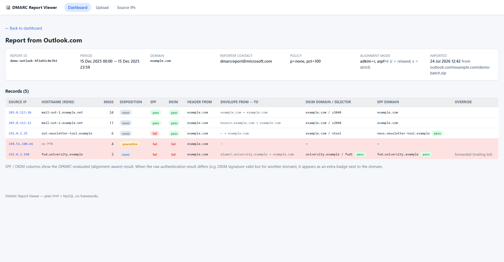
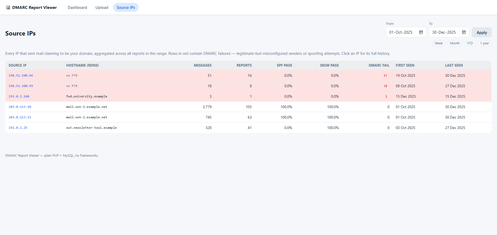
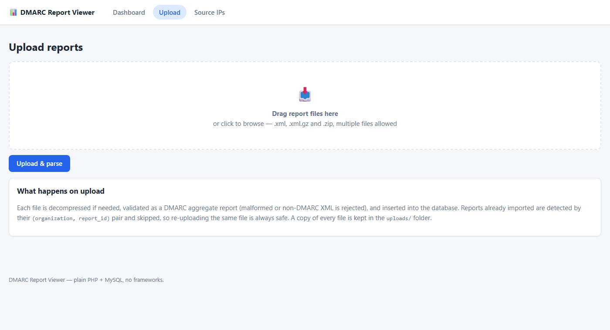

# DMARC Report Viewer

A small, self-hosted web app to collect and visualize **DMARC aggregate
reports** — the `.xml.gz` / `.zip` attachments that Google, Mimecast,
Yahoo & co. email you when you publish a DMARC record.

Plain **PHP 8 + MySQL**. No frameworks, no Composer, no Node, no build
step: clone it, point any PHP-enabled web server at `public/`, done. A
lightweight alternative to hosted DMARC dashboards (Postmark DMARC,
EasyDMARC...) and to heavier self-hosted stacks (parsedmarc + Elasticsearch,
dmarc-visualizer + Grafana).

## Screenshots

> All figures use anonymized demo data — the domain `example.com` and
> [RFC 5737](https://datatracker.ietf.org/doc/html/rfc5737) documentation
> IP ranges, not real reports.

**Dashboard** — pass-rate summary, policy advisor and an interactive daily
timeline; clicking a bar segment lists that day's records below it.



**Report detail** — every record in one aggregate report, with the
alignment-aware SPF/DKIM results and raw-auth badges.



**Source IPs** — every sender aggregated over the range; rows with DMARC
failures are highlighted.



**Upload** — drag & drop `.xml` / `.xml.gz` / `.zip` reports.



## Features

- **Upload page** with drag & drop and multi-file support — accepts
  `.xml`, `.xml.gz` and `.zip` (including zips that batch several reports).
  Files are detected by magic bytes, so misnamed attachments still work.
- **Duplicate-safe**: reports are deduplicated by `(organization,
  report_id)`; re-uploading the same file is always a no-op.
- **Dashboard**: totals, SPF / DKIM / full-alignment pass rates, DMARC
  failure count, a daily stacked-bar timeline (inline SVG, no JS chart
  libs), report list, and top source IPs — all filtered by date range.
  The timeline is interactive without JavaScript: click a bar segment to
  list that day's records for that result, click a legend entry to
  hide/show its series (the chart rescales) — every state is a shareable
  URL. The date filter applies as soon as a date changes, offers quick
  presets (week / month / YTD / … appearing as your data grows), and the
  chosen range follows you across pages.
- **Policy advisor**: tells you when your DMARC pass rate (messages
  where at least one aligned mechanism passes) over the selected period
  makes it safe to move from `p=none` to `p=quarantine` to `p=reject`.
- **Source-IP explorer**: every IP that sent mail as your domain, with
  volume, pass rates, reverse-DNS hostname (resolved and stored at import
  time), first/last seen, and drill-down to every record. Rows with DMARC
  failures are highlighted in red.
- **Report detail**: full metadata + every record, with all identifiers
  (header from, envelope from/to) and the raw auth results (DKIM
  selector/domain, SPF domain, policy-override reasons).
- **IMAP fetcher** (`bin/imap-fetch.php`): optionally pull report emails
  straight from a mailbox over TLS — no PHP imap extension needed (it was
  dropped from core in PHP 8.4; this speaks the protocol over a raw
  socket). Scans all folders, remembers what it has already examined,
  and never disturbs non-report mail. Run it by hand or from a
  scheduled task.
- **Safety**: PDO prepared statements everywhere, all output escaped,
  XXE-hardened XML parsing (DOCTYPEs rejected, `LIBXML_NONET`),
  decompression size limits against zip bombs, structural validation that
  the XML really is a DMARC aggregate report.

## Requirements

- PHP ≥ 8.1 with `pdo_mysql`, `zip`, `zlib`, `simplexml`, `mbstring`
  (and `openssl` for the IMAP fetcher) — all common extensions, but some
  distros package them separately (e.g. `php-mbstring`).
- MySQL 8 (or MariaDB).
- Any web server that runs PHP (Apache, nginx+FPM, or just `php -S`).

## Setup

```sh
git clone <this repo>
cd dmarc-report-viewer

# 1. Database + dedicated user: copy scripts/create_db.sql to
#    scripts/create_db.local.sql (gitignored), set a password in the copy,
#    then run it as an admin user (MySQL Workbench or the mysql CLI).

# 2. App config: copy the template and fill in the same password.
cp config.sample.php config.php        # Windows: copy config.sample.php config.php

# 3. Create the tables (idempotent migration runner).
php scripts/init_db.php

# 4. Serve public/ — quick start:
php -S 127.0.0.1:8082 -t public
# ...or add an Apache vhost with DocumentRoot pointing at public/.
```

The commands assume `php` is on your `PATH`. Open <http://127.0.0.1:8082>,
go to **Upload**, and drop your report files in.

**"Access denied" connecting to MySQL?** MySQL treats `localhost`
(socket/named pipe) and `127.0.0.1` (TCP) as *different* grant hosts.
The app connects over TCP to `127.0.0.1`, and `create_db.sql` creates
the user for both hosts — if you changed `db.host` or wrote your own
`CREATE USER`, make sure the grant host matches.

### IMAP fetching (optional)

Fill the `imap` block in `config.php` — use a dedicated **app password**
(most providers offer them in their security settings, ideally with
IMAP-only scope), never your main password. Then:

```sh
php bin/imap-fetch.php        # process messages new since the last run
php bin/imap-fetch.php --all  # rescan every folder from scratch
```

It scans **every folder** of the account (except Trash, Drafts and
Sent, identified by their IMAP special-use flags), so reports are found
even when they land in the inbox or get filed into the wrong folder;
set `imap.folders` to an explicit list to restrict it. It is designed
to leave your mailbox alone:

- Progress is remembered per folder (`uploads/imap/state.json`), so each
  message is examined at most once across runs — `--all` starts over.
- Only the cheap MIME structure of new messages is fetched; a full
  message body is downloaded only when that structure looks like it
  carries a report file.
- Only messages that yielded a report-file attachment are marked as
  read — everything else keeps its read/unread status. Nothing is ever
  moved or deleted.

Messages larger than the size cap are refused **before** download
(judged by their advertised size), and attachments over
`max_upload_bytes` are skipped before import — the same limits as the
upload page. Schedule it (Windows Task Scheduler, cron) for a
zero-touch pipeline.

## Database schema

Two data tables, created by `php scripts/init_db.php` applying
`migrations/01_schema.sql` (the runner also keeps its own
`schema_migrations` bookkeeping table):

- **`reports`** — one row per aggregate report: reporting org, report id,
  date range, published policy (`p`, `sp`, `pct`, `adkim`, `aspf`).
  Unique on `(org_name, report_id)`.
- **`records`** — one row per `<record>`: source IP (+ stored rDNS
  hostname), message count, DMARC-evaluated SPF/DKIM results,
  disposition, identifiers, raw auth results, override reasons.

Schema changes are numbered `migrations/NN_*.sql` files; `php
scripts/init_db.php` applies pending ones and records them in
`schema_migrations` (safe to re-run).

## Security notes

This app ships **without authentication** — it is meant for a local
machine or a trusted LAN. If you expose it to the internet, put it
behind your web server's auth (HTTP Basic, SSO proxy...) — and consider
that the reports reveal your mail flow metadata.

## License

Released under the [MIT License](LICENSE).
